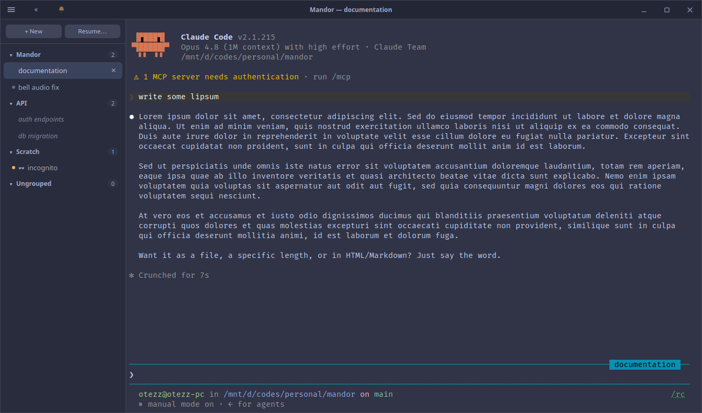

<div align="center">


# Mandor

**A fast, lightweight desktop app for running and managing multiple interactive
`claude` sessions — each in its own real terminal.**

<br />



</div>

Mandor spawns the actual interactive `claude` CLI in a pseudo-terminal (PTY) per
session and renders it with a full terminal emulator. Because every session is a
genuine interactive terminal, you get the complete CLI experience with nothing
reimplemented: native permission prompts, slash commands, `/resume`, output
styling, and `--remote-control` all just work. Mandor adds the part the terminal
doesn't give you — a proper home for many sessions at once.

> **Status:** early, but a daily driver. I've used Mandor every day for about a
> month on **Ubuntu 26.04** — that's the only platform I actually run it on.
> macOS and Windows builds exist and install, but I've never used them day to
> day; treat them as untested.

## Why Mandor

I built this for my own working day. My work is spread across separate repos —
backend, frontend, research — and a single ticket usually spans more than one of
them: one touching both BE and FE means two sessions, in two repos, at two
different stages. Running that in plain terminal tabs gets unwieldy fast — you
lose track of which session is in which repo, which one is waiting on you, and
which one you were about to resume.

Mandor keeps each session a real terminal but wraps the pile in a sidebar you can
actually navigate, so juggling a dozen sessions across projects stays calm
instead of chaotic.

The design goal is deliberately narrow: **be the best possible shell around the
real CLI, and reimplement none of it.** Mandor never parses or re-renders the
conversation — it hosts the genuine `claude` process and stays out of the way.

## Features

- **Session sidebar** — organize sessions into groups, drag to reorder, and see
  at a glance which are working and which need your attention.
- **New & resume** — start a session in any directory (with a recent-directory
  picker), or resume an existing one; supports `-w` worktrees, `--model`, and
  `--remote-control`.
- **Incognito sessions** — run against a throwaway config directory so nothing is
  written to your `~/.claude` history.
- **Themes & fonts** — Catppuccin flavors, a Ghostty-style dark theme, or paste
  your own palette; pick any installed monospace family, set a point size, and
  toggle ligatures.
- **Attention & notifications** — a titlebar bell and desktop notifications tell
  you when a session finishes or needs input; an audible bell is included.
- **Split view** — tile up to four sessions in one window to watch related work
  (a backend and a frontend session on the same ticket) side by side.
- **Suspend idle sessions** — stop a session's `claude` to reclaim its memory
  while keeping it resumable, manually or automatically after N idle hours; pin
  the ones that must keep running.
- **Filter the sidebar** — narrow a long list to just what's running or what
  needs you.
- **Find-in-session** and **pop-out windows** for focused work.
- **PR awareness** — a session shows a badge when it has an associated pull
  request.
- **Restart-to-update** prompt when a new build is installed.

## Install

Grab a build from the [latest release](https://github.com/otezz/mandor/releases/latest)
(or build it yourself, below).

**Linux** (x86_64):

```bash
sudo dpkg -i Mandor_*_amd64.deb           # Debian / Ubuntu
sudo dnf install ./Mandor-*.x86_64.rpm    # Fedora / RHEL
chmod +x Mandor_*_amd64.AppImage && ./Mandor_*_amd64.AppImage   # any distro
```

Arch / CachyOS: the AppImage works as-is.

**macOS** (universal — Apple Silicon & Intel): open `Mandor_*_universal.dmg` and
drag Mandor to Applications. The build is only ad-hoc signed — not signed with a
Developer ID and not notarized — so Gatekeeper refuses to launch it while the
download carries a quarantine flag (`spctl` reports `no usable signature`).
Clear the flag once per install:

```bash
xattr -dr com.apple.quarantine /Applications/Mandor.app
```

Repeat after installing each new build; macOS re-applies quarantine to every
download. The old right-click → **Open** trick is unreliable here: macOS 15
(Sequoia) removed that bypass for ad-hoc-signed apps.

**Windows** (x86_64, experimental): run `Mandor_*_x64-setup.exe`. The installer
is **unsigned**, so SmartScreen will warn you (More info → Run anyway). This
build is untested — it compiles and installs, but I don't run Windows; if
sessions fail to start there, please open an issue.

Mandor launches the `claude` CLI from your `PATH`, so make sure `claude` is
installed and runnable from a terminal first.

## Build from source

Requires [Bun](https://bun.sh), a Rust toolchain, and the
[Tauri v2 system dependencies](https://v2.tauri.app/start/prerequisites/) for
your platform.

```bash
bun install
bun run tauri build --bundles deb
# → src-tauri/target/release/bundle/deb/
```

## Develop

```bash
bun install
bun run dev        # dev app: separate identifier/config namespace + amber titlebar
```

- Frontend edits: run `bun build ui/app.js --target=browser` to syntax-check,
  then press `Ctrl+R` in the running app. Backend (Rust) edits auto-rebuild.
- Format everything: `bun run fmt` (Prettier over `ui/`, `cargo fmt` for Rust).

The frontend is intentionally vanilla JS/CSS with **no bundler and no
framework** — `ui/` is served as-is, and third-party libraries are vendored into
`ui/vendor/`. See `CLAUDE.md` for the full project constraints and architecture
notes.

## Tech

Tauri v2 (Rust) · `portable-pty` for PTYs · vanilla JS/CSS frontend ·
[`xterm.js`](https://xtermjs.org/) for terminal rendering (vendored).

## Credits

- Bell / notification sound: ["Film special effects — short digital notification
  alert"](https://pixabay.com/sound-effects/film-special-effects-short-digital-notification-alert-440353/)
  from Pixabay, used under the [Pixabay Content License](https://pixabay.com/service/license-summary/)
  (free to use, no attribution required). Bundled as `ui/notification.mp3`
  (re-encoded to mono for size).
- Terminal rendering: [`xterm.js`](https://xtermjs.org/) (vendored in `ui/vendor/`).
- Default terminal font: [JetBrains Mono](https://www.jetbrains.com/lp/mono/) (OFL).

## This is one person's workflow — fork it

Mandor is shaped end to end by how *I* work: the grouping, the defaults, the
keyboard shortcuts, what gets a notification, what doesn't. That's the point —
it's a tool I use, not a product trying to suit everyone.

So if something here doesn't fit your style, don't wait on me: **fork it and make
it yours.** That's the intended outcome, and the GPL-3.0 license guarantees you
can. Issues and PRs are welcome too, but a fork that fits your day beats a
feature request that half-fits mine.

## License

[GPL-3.0](LICENSE). Mandor is an independent project and is not affiliated with
or endorsed by Anthropic.
